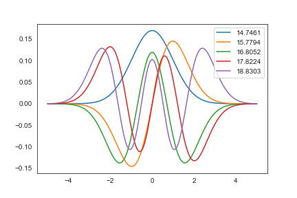

# DFT (Density Functional Theory) tutorial code in Python

- [Jupyter Notebook](./numpy_1ddft.ipynb) ([Japanese](./numpy_1ddft_jp.ipynb))
- [Run in browser](https://colab.research.google.com/github/tamuhey/python_1d_dft/blob/master/numpy_1ddft.ipynb) ([Japanese](https://colab.research.google.com/github/tamuhey/python_1d_dft/blob/master/numpy_1ddft_jp.ipynb))
- [Simplified Chinese](https://github.com/m3lab-zzl/python_1d_dft/)

- Goal: write our own Kohn-Sham (KS) DFT code
  - Target: a harmonic oscillator including kinetic energy, electrostatic repulsion between the electrons, and the local density approximation for electronic interactions, ignoring correlation.

## Refs.

- http://dcwww.camd.dtu.dk/~askhl/files/python-dft-exercises.pdf
